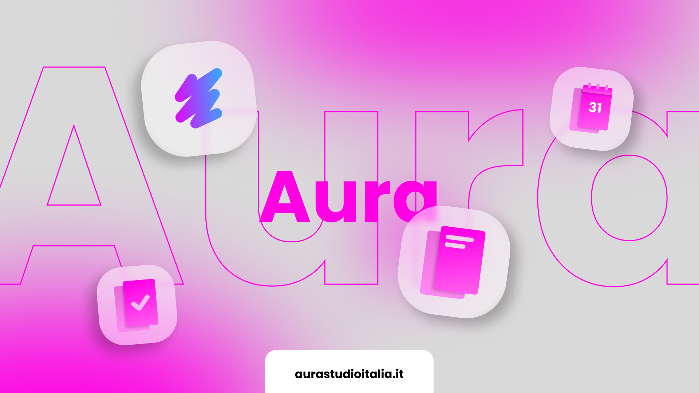

  

# 🚀 Aura Open Source Hub

Benvenuto/a nella **repository centrale open-source dell’ecosistema Aura**.

Questo hub raccoglie tutti i servizi ufficiali Aura, i loro repository GitHub e i link diretti di accesso alle applicazioni.

👉 Un punto unico dove trovi tutto: trasparenza, codice e accesso immediato ai servizi.

---

## 📦 Panoramica

L’obiettivo di questo hub è mantenere tutto semplice, ordinato e accessibile:

- 📂 Codice sorgente pubblico (GitHub)
- 📘 Documentazione ufficiale
- 🔗 Link diretti ai repository
- 🌐 Link diretti ai servizi live
- 🧩 Descrizione chiara di ogni progetto

---

## 🧩 Servizi disponibili

| Nome Servizio | Repository | Servizio Live | Descrizione |
|----------------|------------|----------------|-------------|
| Aura Docs | https://github.com/madebyanto/auradocs | https://docs.aurastudioitalia.it | Documentazione centralizzata per tutto l’ecosistema Aura. |
| Aura Tasks | https://github.com/madebyanto/auratasks | https://tasks.aurastudioitalia.it | Gestione task semplice e organizzata per team e progetti. |
| Aura Calendar | https://github.com/madebyanto/auracalendar | https://calendar.aurastudioitalia.it | Calendario personale e collaborativo con sincronizzazione. |
| Aura Chat | (ancora non disponibile) | (ancora non disponibile) | Calendario personale e collaborativo con sincronizzazione. |
| Aura Launchboard | https://github.com/madebyanto/aura-launchboard | https://apps.aurastudioitalia.it | Dashboard centrale per accedere a tutti i servizi Aura. |
| Nyra | https://github.com/madebyanto/nyra-website | https://nyra.aurastudioitalia.it/app | Assistente AI ufficiale dell’ecosistema Aura. |
| Aura Website | https://github.com/madebyanto/aurastudioitalia | https://aurastudioitalia.it | Sito principale ufficiale di Aura. |
| Aura Store | https://github.com/madebyanto/aura-store | https://store.aurastudioitalia.it | Store ufficiale per app e strumenti Aura. |
| ACM (Legacy) | https://github.com/madebyanto/pctool.aura | (non disponibile) | Tool legacy per monitoraggio PC. Non più supportato. |

---

## 🔒 Filosofia del progetto

Aura si basa su principi chiari e non negoziabili:

- 🔐 Privacy by design (zero sorveglianza inutile)
- 🧠 Raccolta dati minima o nulla
- 🌍 Open source su GitHub
- 💸 Accesso gratuito per sempre
- 🤝 Supporto volontario, trasparente e non invasivo

---

## ⚡ Accesso rapido

Tutti i servizi sono raggiungibili anche direttamente tramite Launchboard in modo user-friendly, moderno e nativo.

👉 Vai su Launchboard: https://apps.aurastudioitalia.it

---

## 📍 Note importanti

- Tutti i progetti sono in continuo sviluppo
- Alcuni servizi potrebbero essere in beta o early-stage
- Gli URL possono cambiare durante l’evoluzione del sistema

---

## 🔗 GitHub

Tutto il codice è ospitato su :contentReference[oaicite:0]{index=0}, la piattaforma standard per sviluppo open-source e collaborazione globale.

---

## 🚀 Contribuisci

Vuoi contribuire?

- Segnala idee e bug
- Proponi feature
- Partecipa allo sviluppo

👉 Tutto avviene tramite la community ufficiale su Discord (canale dev & feedback)

---

## ✨ Aura Ecosystem

Un ecosistema moderno, leggero e privacy-first, progettato per essere:
- trasparente
- scalabile
- indipendente
- costruito per durare
